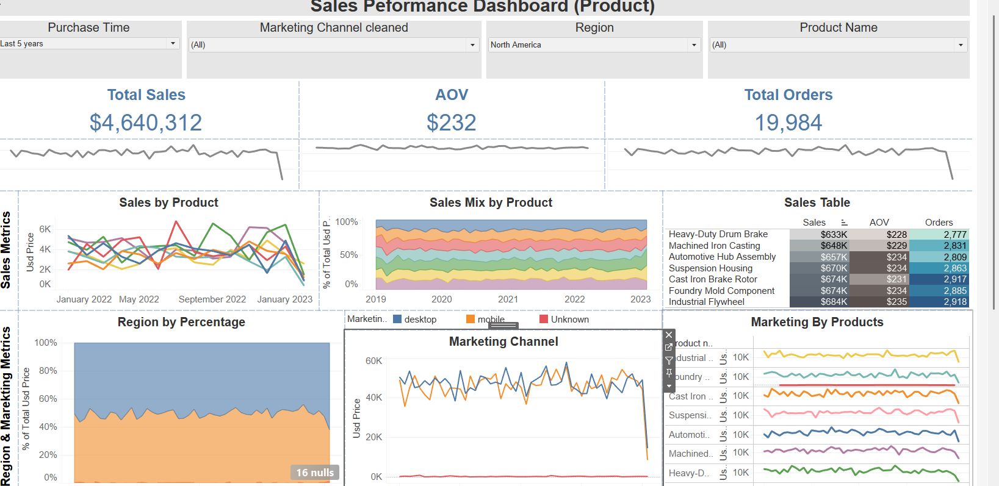

# Exploratory-Analysis---Product-Analysis-of-Iron-works-Inc.

## BACKGROUND

Ironworks is a vehicle parts manufacturing company, which has been establised in 2018 September. It is a global seller of vehicle parts worldewide via its website and mobile app.

The company has significant amount of data in it sales, marketing efforts, operational efficiency, product offerings and geographic location that has a huge scope to utilize to get insights to make better decision. This project thoroughly analyzes and synthesizes this data inorder to uncover critical insights that will inprove Ironworks commercial success.

Insights and recommendations are provided on the following key areas:

- Sales Trend Analysis: Evalution of historical sales pattern globally focusing on total sales, Average order volume (AOV), number of orders
- Product Level Perfromance: Analysing the ironwork's various product line, understanding their impact of saes and product.
- Marketing Channel Evaluation: An assessment of the marketing channel has been taken into consideration to undertand the sales metrics
- Regional Insights: An evalutaion of sales and orders by region.

    An interactive Tableua dashboard can be seen here [https://public.tableau.com/views/SalesPerfomanceDashboardProduct-Arham/Dashboard1?:language=en-US&:sid=&:redirect=auth&:display_count=n&:origin=viz_share_link]

## Data Structure and Initial Checks

Ironworks detailed analysis using excel Pivot table can be seen [here](your-link).

## Executive Summary

### Overview of Findings
The Sales Performance Analysis Dashboard presents an in-depth view of product sales from 2019 to 2022, with total sales of approximately $4.6 million and monthly sales ranging from $144 to $8.3K. The top-performing product is the Automotive Hub Assembly (~$0.657M), while the lowest performer is the Drum Brake (~$0.632M). Among categories, Heavy Duty Drum Brakes contributed to roughly 14% of total sales. January 2023 experienced a significant spike, likely due to seasonal vehicle failures, post-holiday maintenance, and winter-related repairs, indicating company-wide or macro-level impacts on sales.

The dashboard highlights seasonal and temporal trends, showing that sales peaked in January, June, August, and October 2021, with a notable drop in November 2022. Cast Iron Brake and Machine Iron Casting saw their largest price dip in January 2022. These patterns emphasize the importance of strategic promotions, pricing adjustments, and timing marketing efforts to align with historical sales trends. Additionally, Direct and Mobile channels emerged as primary revenue drivers, supporting increased investment and resource allocation for these channels.

The analysis also provides geographical and category-level insights. North America consistently shows the highest sales, suggesting the need to prioritize inventory, marketing, and retention strategies in that region. Conversely, the UK exhibits the lowest performance, signaling opportunities to reassess pricing, distribution, and localized marketing. Across all products, similar dips were observed in November 2022, and annual price spikes occur across multiple years, indicating consistent seasonal effects. These insights support data-driven decision-making for pricing, promotions, and operational planning.

